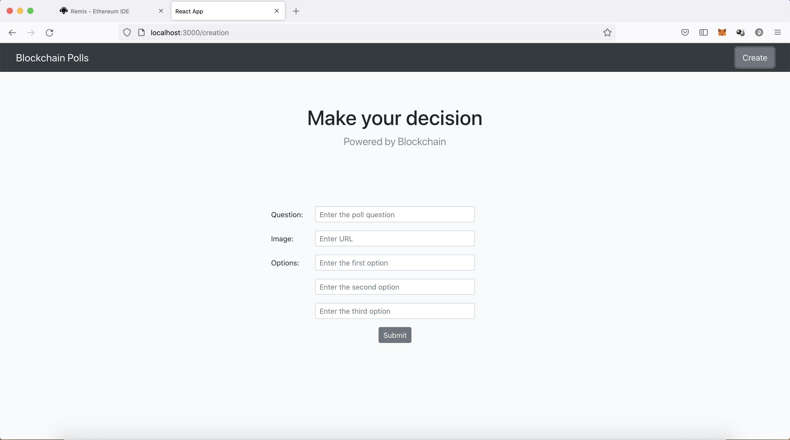
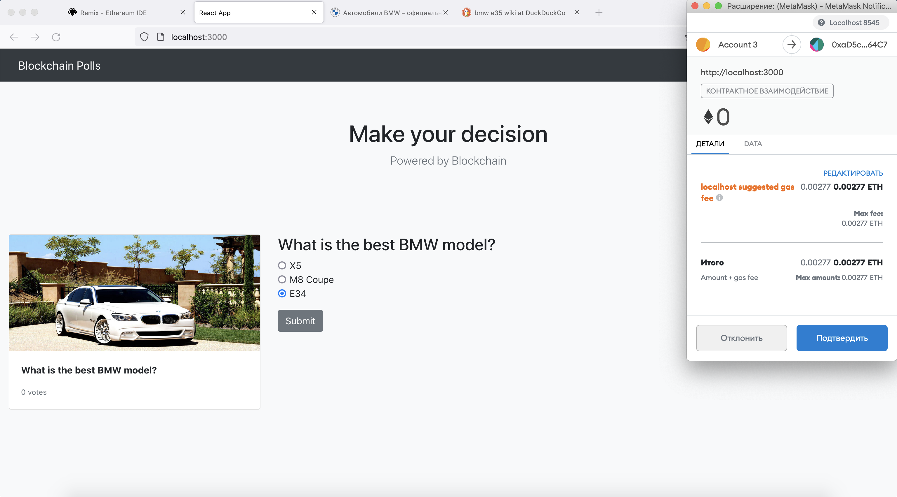
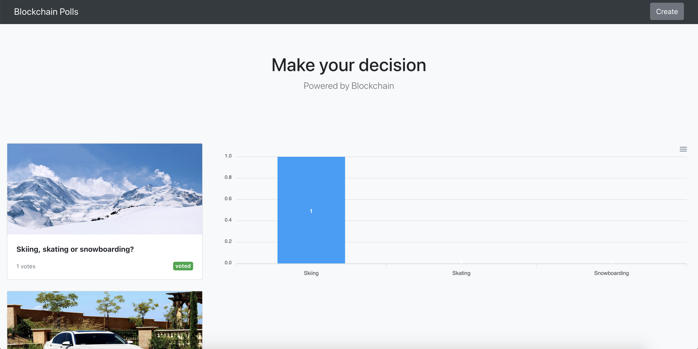

# Подготовка к локальному запуску проекта

1. Установить Ganache: создать workspace или нажать quick start.
Запомнить адрес, на котором запущена локальная сеть (напр. localhost:8545).
   
2. Установить и активировать Metamask -  с использованием приватного ключа импортировать в него аккаунт из Ganache.

3. В Remix задеплоить смарт-контракт (/src/blockchain/contract.sol) и выбрать в качестве среды Web3 Provider - должен подтянуться аккаунт из Ganache.

4. В файл contract.json скопировать ABI контракта из Remix и адрес контракта из списка транзакций Ganache (или также найти в Remix).

5. Запустить сервер и удостовериться, что Metamask обнаружен.

Для запуска сервера в рабочей директории ввести:

### `npm start`

Приложение запустится в режиме разработки по адресу [http://localhost:3000](http://localhost:3000)

## Демонстрация проекта

Создание голосования:
​

Выбор вариантов:
​

Результаты голосования:
​

